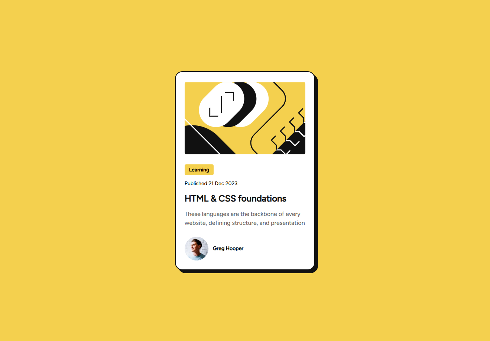

# Frontend Mentor - Blog preview card solution

This is a solution to the [Blog preview card challenge on Frontend Mentor](https://www.frontendmentor.io/challenges/blog-preview-card-ckPaj01IcS). Frontend Mentor challenges help you improve your coding skills by building realistic projects.

## Table of contents

- [Overview](#overview)
  - [The challenge](#the-challenge)
  - [Screenshot](#screenshot)
  - [Links](#links)
- [My process](#my-process)
  - [Built with](#built-with)
  - [What I learned](#what-i-learned)
  - [Useful resources](#useful-resources)
- [Author](#author)

## Overview

### The challenge

Users should be able to:

- See hover and focus states for all interactive elements on the page

### Screenshot

### Links

[Live Site URL](https://kapteynuniverse.github.io/Blog-Preview-Card/)

[Solution URL](https://www.frontendmentor.io/solutions/blog-preview-card-luRsK5fVLd)

## My process

### Built with

- Semantic HTML5 markup
- CSS custom properties
- Flexbox
- Mobile-first workflow

### What I learned

While building this project, I improved my understanding of:

- Using local fonts: I learned how to self-host fonts using the @font-face rule instead of relying on external CDNs. This gives more control over performance, reduces third-party requests, and improves privacy. I also better understood how to define font-family, src, font-weight, font-style, and font-display properly.

- Decorative images and accessibility: I learned that purely decorative images should not be announced by screen readers. For such images, using alt="" ensures assistive technologies ignore them, preventing unnecessary or confusing information for users.

- The <time> element: I improved my understanding of the semantic <time> element and how it helps represent dates and times in a machine-readable format using the datetime attribute. This improves accessibility, SEO, and data parsing.

- clamp() function: I learned how to use the clamp() CSS function to create fluid, responsive values without relying entirely on media queries. By defining a minimum, preferred, and maximum value, clamp() makes typography and spacing scale smoothly across different screen sizes.

- CSS combinators: I strengthened my understanding of CSS combinators such as the descendant ( ), child (>), adjacent sibling (+), and general sibling (~) selectors.

### Useful resources

- [@font-face](https://developer.mozilla.org/en-US/docs/Web/CSS/Reference/At-rules/@font-face) : Helped me understand how to properly define and load custom fonts locally.
- [Decorative images](https://www.w3.org/WAI/tutorials/images/decorative/) : Clarified when and how to use empty alt attributes for accessibility.
- [time element](https://developer.mozilla.org/en-US/docs/Web/HTML/Reference/Elements/time) : Explained how to correctly structure machine-readable dates and times using semantic HTML.
- [clamp() function](https://developer.mozilla.org/en-US/docs/Web/CSS/Reference/Values/clamp) : Helped me understand how to create fluid and responsive sizing using modern CSS techniques.
- [Combinators](https://developer.mozilla.org/en-US/docs/Web/CSS/Reference/Selectors/Combinators) : Helped me better understand how to target elements based on their structural relationships in the DOM.

## Author

- Frontend Mentor - [Asilcan Toper](https://www.frontendmentor.io/profile/KapteynUniverse)
